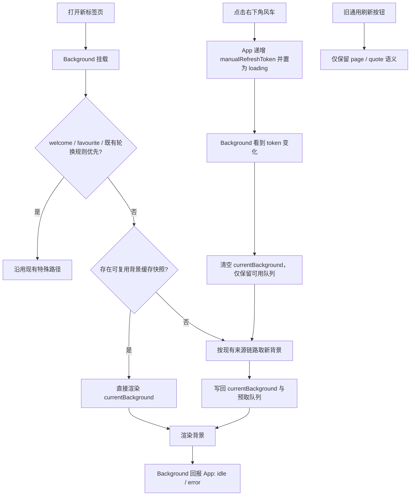

# background-manual-refresh design

## 0. 术语约定

| 术语 | 定义 | 防冲突结论 |
|---|---|---|
| 背景缓存快照 | 保存在 `localStorage.currentBackground` 的最近一次已解析背景数据，用于下次打开标签页时直接复用 | 现有代码已使用 `currentBackground` 这个 key，但目前只写不读；本 feature 复用该名字，不再新造第二个缓存 key |
| 背景专用刷新按钮 | 新增在页面右下角、只负责触发背景刷新的悬浮风车按钮 | 与现有 `Refresh` 组件区分；旧按钮继续叫“通用刷新按钮” |
| 通用刷新按钮 | 现有 navbar 上根据 `refreshOption` 刷新页面、背景、名言或两者的按钮 | 本 feature 不改变它的文案、设置项和触发语义 |
| 手动背景刷新控制面 | 由 `App` 持有的手动刷新请求令牌与加载状态，通过 props 传给 `Background` 与 `Navbar` | 这是新风车的唯一刷新通路，不在现有 EventBus 上新增第二条订阅 seam |
| 源配置变更 | 会改变背景来源或候选集合的设置修改，例如背景类型、API、分类、质量、自定义背景列表、排除当前图片、远端同步落地的背景设置 | 这类修改必须使背景缓存快照失效，避免新标签页先显示旧来源的背景 |

## 1. 决策与约束

### 需求摘要

- 做什么：让新标签页优先复用上一次已显示的背景，不在每次打开标签页时重新抽取；同时新增一个只刷新背景的风车按钮
- 为谁：已经把背景作为视觉主内容、希望降低重复请求和随机跳图干扰的标签页用户
- 成功标准：
  - 对 `api`、`custom`、`random_colour`、`random_gradient` 四类随机来源，在同一组背景设置不变时，连续打开新标签页应保持同一张背景，直到用户显式点击风车
  - 对 `photo_pack`，继续尊重既有 `backgroundchange` 时间语义；若轮换条件未满足，重新打开新标签页不应无谓换图
  - 点击右下角风车后只刷新背景，不触发整页 reload，也不影响原有名言/页面刷新链路
  - 原有通用刷新按钮不再承担背景刷新语义，只保留页面/名言刷新
- 明确不做什么：
  - 不实现“浏览很多背景并手动挑选”的图库/列表页
  - 不改写原有通用刷新按钮的用途，也不删除 `refreshOption`
  - 不改动 Dropbox 配置同步 schema，不把 `currentBackground`、`imageQueue` 纳入同步
  - 不重做背景来源架构，不在本次引入新的第三方背景接口

### 复杂度档位

走前端交互 feature 默认档位，无偏离：健壮性 `L2`、结构 `modules`、性能 `reasonable`、可读性 `team`、可演进性 `active`、可测试性 `testable`。

### 关键决策

1. **风车按钮独立于通用刷新按钮，固定挂在页面右下角，而不是继续混在 navbar 工具组里。**
   - 原因：用户希望把“刷新背景”做成页面级悬浮入口，并与右上角一组工具按钮彻底分开
2. **启动复用继续沿用 `currentBackground` 作为背景缓存快照，而不是另起第二套缓存。**
   - 原因：现有加载链路已经在 `backgroundLoader` 中写入该 key，问题在于没有消费它；补齐读路径比新增并迁移新 key 风险更低
3. **背景缓存失效与 `imageQueue` 失效要被同一个帮助函数统一处理。**
   - 原因：当前多个入口只会清空 `imageQueue`，如果单独补 `currentBackground` 清理，很容易遗漏导致“设置改了但仍先闪旧图”
4. **风车动画不依赖 EventBus 或超时猜测，而依赖 `App` 内部的手动刷新状态。**
   - 原因：`Background` 与 `Navbar` 已同属 `App` 渲染树，可直接通过 props 协调；继续在现有 `EventBus` 上新增订阅点会继承它无法对称卸载的历史问题
5. **保留既有 `photo_pack` / `backgroundchange` 的时间语义，不借这次 feature 重写老的轮换规则。**
   - 原因：本次问题聚焦于“重新打开标签页时无谓重载”；若已有时间驱动轮换生效，应继续由现有策略主导，而不是被缓存永久盖住
6. **风车按钮继承现有 `refresh` 总开关，但不继承 `refreshOption`，且旧通用刷新按钮只保留 page/quote 两种语义。**
   - 原因：用户已明确要求“刷新背景”只能由风车入口触发；旧刷新按钮继续保留背景选项会造成概念混乱

### 前置依赖

- 无外部服务或权限前置依赖
- 现有 requirements 层尚未建立对应 capability 文档，本次 design 先以 feature spec 为唯一契约；若后续继续扩展到背景图库，再单独回填 req

### Top 3 风险

1. **缓存失效点漏清理。**
   - 缓解：把“清队列 + 清当前背景”收敛成单一 helper，并在验收场景中覆盖 UI 设置、排除图片、marketplace、config sync 四类入口
2. **风车动画与真实加载完成不同步。**
   - 缓解：由 `App` 持有 `manualBackgroundRefreshState`，`Background` 只负责回报状态，按钮只消费 props
3. **旧刷新语义被误伤。**
   - 缓解：把旧 `Refresh` 组件视为兼容层，不改其 `refreshOption` 分支；新增风车按钮单独挂载、单独文案、单独 aria

### 非显然依赖

- `currentBackground` 当前虽不参与 Dropbox sync，但其失效逻辑会受到 `configSyncApplied` 触发后的本地设置刷新影响；实现时需要确认同步后的背景设置修改也会走统一失效路径
- `backgroundExclude` 由 `ExcludeModal` 单独写入，若这里漏掉缓存失效，用户排除当前图片后下次开标签页仍可能先看到旧图

### 关键假设

- 假设用户要保留现有通用刷新按钮给已有习惯继续使用，而不是用风车完全取代它
- 假设新增按钮不需要再增加单独开关，而是沿用现有 `refresh` 总开关做显示控制
- 假设背景图库页属于后续更大需求，本 feature 不需要为其提前预埋列表分页或选择器协议

### 必跑验证命令

- 预检：`bun run test:sync`
  - 目的：确认现有同步测试基线未因背景缓存清理改动受损
- 核心：`bun run lint`
  - 失败处理：若为既有红灯，需在实现记录中标注“基线问题”；若为新增红灯必须修复
- 核心：`bun run build`
  - 失败处理：阻塞
- 建议新增：`bun test tests/background-cache.test.mjs`
  - 目的：验证背景缓存复用/失效判定的纯逻辑

### 证据类型

- 纯逻辑缓存判定：Node 测试
- navbar 风车交互：浏览器手工验证或截图
- 旧刷新兼容：浏览器手工验证
- 设置切换与 config sync 落地后的缓存失效：浏览器手工验证 + localStorage 事实检查

### 交付物清单

- 新的 navbar 背景刷新入口（代码与文案）
- `App -> Modals -> Navbar` / `App -> Background` 手动刷新控制面
- 背景缓存读取/失效帮助函数
- 对现有背景来源切换入口与 config sync apply 的缓存失效接入
- 对应测试与多语言文案补充
- feature design / checklist / design-review 文档

### 清洁度规则

- 不允许新增临时 `console.log`、TODO/FIXME、注释掉的旧逻辑或无用 import
- 若为了手工定位缓存状态需要临时调试输出，必须在提交前删除，不作为功能的一部分保留

## 2. 名词与编排

### 2.1 名词层

#### 现状

- `src/features/background/hooks/useBackgroundLoader.js` 的 `loadBackground()` 在组件挂载时无条件调用 `getBackgroundData()`，只处理 welcome 图特例，不读取 `currentBackground`
- `src/features/background/api/backgroundLoader.js` 会在取到 API、自定义背景后写入 `localStorage.currentBackground`，但这个 key 当前只写不读；`photo_pack` 仍走自己的时间轮换与索引路径
- `src/features/navbar/components/Refresh.jsx` 是现有通用刷新按钮；它根据 `refreshOption` 决定触发 `backgroundrefresh`、`quoterefresh` 或整页 `reload`
- 多处背景设置入口会清空 `imageQueue`，但不会同步清空 `currentBackground`
- `App -> Modals -> Navbar` 与 `App -> Background` 当前没有共享“手动背景刷新中”的显式 React 状态面

#### 变化

1. **背景缓存快照从“写入后遗忘”升级为“启动优先复用”的有效名词。**
   - `currentBackground` 继续保存最近一次成功显示的背景数据
   - 新增纯逻辑 helper 负责：
     - 读取当前缓存是否可复用
     - 统一失效 `currentBackground` 与 `imageQueue`
2. **新增背景专用刷新按钮。**
   - 它是页面右下角的悬浮组件，不读取也不写 `refreshOption`
   - 可见性依赖四件事：`background === true`、`backgroundType !== 'colour'`、现有 `refresh` 总开关开启、当前不处于 `favourite` 或 `welcome` 覆盖状态
3. **新增手动背景刷新控制面。**
   - `App` 持有 `manualBackgroundRefreshToken` 与 `manualBackgroundRefreshState`
   - `Navbar` 里的风车按钮只通过 props 发起手动刷新并消费旋转态
   - `Background` 只在看到 token 变化时执行一次手动刷新，并在收尾时把状态回报给 `App`
4. **明确背景类型适用矩阵。**
   - `api` / `custom` / `random_colour` / `random_gradient`：进入“固定直到手动刷新”的新语义
   - `photo_pack`：保留既有时间轮换语义；在未到轮换时点时复用当前图片
   - `colour`：保持确定性纯色，不显示风车按钮
   - `favourite` / `welcome`：继续作为高优先级覆盖路径，不参与本次随机缓存语义调整；激活期间风车按钮隐藏

##### 接口示例

```js
// 来源：src/App.jsx
const [manualBackgroundRefreshToken, setManualBackgroundRefreshToken] = useState(0);
const [manualBackgroundRefreshState, setManualBackgroundRefreshState] = useState('idle');
```

```js
// 来源：App -> Background 的控制面
<Background
  manualRefreshToken={manualBackgroundRefreshToken}
  onManualRefreshStateChange={setManualBackgroundRefreshState}
/>
<BackgroundRefresh phase={manualBackgroundRefreshState} onClick={requestManualBackgroundRefresh} />
```

```js
// 来源：新增的背景缓存 helper（供 useBackgroundLoader、背景设置入口、config sync apply 路径复用）
const cached = readReusableBackground();
if (cached) {
  updateBackground(cached);
  return;
}
invalidateBackgroundCache();
```

##### Interface 设计检查

- Module：背景缓存 helper + `App` 内部手动刷新控制面（现状为散落在 loader、options、marketplace 中的 localStorage 操作，且没有 React 内共享状态）
- Interface：caller 只需要知道“读可复用缓存”“统一失效缓存”“发起一次手动背景刷新”“读取手动刷新状态”；不需要知道 `currentBackground`、`imageQueue`、token 递增细节
- Seam：seam 放在 `App` 与 `Background` / `BackgroundRefresh` 的 props 边界，以及各设置入口/`configSyncApplied` 复用的统一失效 helper；测试也通过这些 seam 观察行为
- Depth / locality：缓存失效复杂度应被压进 helper，而不是散到每个设置入口和按钮组件；删掉 helper 后，复杂度会重新扩散到多处 caller，因此这个 module 有价值
- Dependency strategy：`in-process`，只处理前端本地状态与现有 EventBus 兼容层，不引入 adapter
- Adapter：无；这里只有同进程状态协调，不需要假 seam
- Test surface：缓存判定测试、设置变更后的缓存失效、手动点击风车后的状态变化，都能通过这个接口观察

### 2.2 编排层



#### 现状

- `Background` 挂载后通过 `useBackgroundLoader` 直接执行加载
- `getBackgroundData()` 按 `backgroundType` 分流到 API、自定义、纯色、随机色、photo pack 等路径
- `backgroundrefresh` 事件会触发 `refreshBackground()`，但没有配套的“加载开始/完成”显式状态
- 只要新标签页重新挂载，随机背景类来源就会再次抽取，即使用户没要求切换
- `configSyncApplied` 会导致 `App` 重挂载背景与中心内容，但当前没有与背景缓存失效绑定

#### 变化

1. **启动路径先做“是否可复用缓存”的分流。**
   - 在 welcome / favourite / 既有 `photo_pack` 时间轮换规则之后、真正请求新背景之前，读取 `currentBackground`
   - 可复用则直接 `updateBackground()`，不进入随机抽图/选图链路
2. **手动背景刷新走 React 树内的独立控制面。**
   - 新风车按钮不复用 `backgroundrefresh` 事件，而通过 `App` 内部 token 驱动 `Background` 执行一次手动刷新
   - 旧通用刷新按钮不再承担背景刷新语义，只保留 page / quote 行为
   - 手动刷新前移除当前缓存快照，使下一次加载一定选出“下一张/下一组”背景，而不是再次复用旧图
3. **源配置变更先失效缓存，再允许后续渲染取新图。**
   - API、分类、质量、自定义背景集、排除当前图片、marketplace 安装/卸载、`configSyncApplied` 相关背景设置落地统一走 `invalidateBackgroundCache()`
   - 对 config sync 而言，顺序必须是“先失效缓存，再触发任何 `backgroundrefresh` 与 `configRevision` 重挂载”，不允许先按旧缓存刷新一次
4. **加载状态可观测。**
   - `App` 在发起手动刷新时把风车状态置为 `loading`
   - `Background` 在成功或失败收尾时回报 `idle` / `error`，避免纯定时器猜测

#### 流程级约束

- 错误语义：
  - 若读取缓存失败或缓存内容损坏，直接丢弃缓存并回退到现有 `getBackgroundData()` 链路
  - 若手动刷新失败，保持当前已显示背景不闪空白，并结束风车旋转
- 幂等性：
  - 同一时刻已有背景加载进行中时，再次点击风车不应并发触发第二次加载
- 顺序约束：
  - `invalidateBackgroundCache()` 必须先于新的随机背景选择发生
  - 背景相关 sync key 落地时，必须先执行 `invalidateBackgroundCache()`，再触发任何 `backgroundrefresh` 或 `configRevision` 重挂载
  - `manualBackgroundRefreshState` 的完成态必须只在本轮手动刷新收尾后回报
- 扩展点：
  - 若未来要做背景图库页，可以在“缓存 helper”旁继续扩展“显式选中某张背景”的写入能力，而不是改 navbar 组件
- 可观测点：
  - `localStorage.currentBackground`
  - `App` 内的 `manualBackgroundRefreshState`
  - 浏览器中可见的背景 URL / 摄影师信息是否保持一致

### 2.3 挂载点清单

- `App` 顶层状态：新增手动背景刷新 token / state 控制面 — 新增
- 页面根层悬浮控件：右下角新增背景专用风车按钮挂载点 — 新增
- 旧 navbar 刷新按钮：移除背景刷新语义，仅保留 page / quote — 修改
- 背景启动加载入口：`useBackgroundLoader` 的挂载路径增加“缓存可复用判定” — 修改
- 背景来源配置变更入口：背景设置、排除图片、marketplace 安装/卸载、config sync apply 共用的缓存失效入口 — 修改
- 国际化文案：风车按钮 tooltip / aria 文案 key — 新增

### 2.4 推进策略

1. 背景缓存判定：抽出可复用缓存与统一失效 helper，并让启动加载优先消费它
   - 退出信号：在不改背景设置的前提下，重新打开新标签页会直接显示同一张背景；纯逻辑测试覆盖缓存复用与失效判定
2. 手动刷新控制面：由 `App` 持有 token/state，把新风车请求从 React 树内传到 `Background`
   - 退出信号：点击风车后 `Background` 只响应一次 token 变化，风车旋转态与加载收尾一致
3. 页面右下角风车：新增独立悬浮组件与展示规则，并显式继承现有 `refresh` 总开关
   - 退出信号：`refresh=false` 时风车隐藏；`refresh=true` 且背景类型可刷新时出现风车；旧按钮只保留 page / quote 行为
4. 源配置变更接入：让会改变背景来源的入口与 `configSyncApplied` 共同调用缓存失效 helper
   - 退出信号：改 API、分类、自定义背景列表、排除当前图片，或远端同步改背景配置后，下次开标签页不会先闪旧图，且 config sync 不会先按旧缓存触发一次背景刷新
5. 验证与收尾：补背景缓存测试、文案、lint/build/manual evidence
   - 退出信号：核心命令通过，且验收矩阵中的核心场景都有命令或手工证据

### 2.5 结构健康度与微重构

##### 评估

- 文件级 — `src/features/background/hooks/useBackgroundLoader.js`：54 行，职责集中在“启动/刷新加载”；适合新增少量调度，但不适合继续堆积缓存细节
- 文件级 — `src/features/background/api/backgroundLoader.js`：222 行，已同时承担多类背景来源分流；若把缓存失效与可复用判定继续塞进这里，会进一步混合“选图策略”和“缓存策略”
- 文件级 — `src/App.jsx`：154 行，已承担 config sync remount 与页面外壳状态；适合新增轻量 token/state，但不应把缓存细节塞回本文件
- 文件级 — `src/features/misc/modals/Modals.jsx`：115 行，当前只负责 modal / navbar 编排；适合透传 props，不适合承接背景业务逻辑
- 文件级 — `src/features/navbar/Navbar.jsx`：128 行，仍处在可控范围；适合只新增一个独立按钮挂载，不适合把按钮内部状态逻辑直接写回本文件
- 文件级 — `src/features/navbar/components/Refresh.jsx`：80 行，职责清楚；不应为了风车需求继续叠加第二套语义
- 目录级 — `src/features/navbar/components/`：当前 6 个同层文件，命名模式清晰，再新增一个 `BackgroundRefresh` 组件不会造成摊平
- 目录级 — `src/features/background/`：文件较多，但按 `api / hooks / components / options` 已分组；新增缓存 helper 放到背景域内是自然归属

##### 结论：不做

- 本次不做额外“只搬不改行为”的微重构
- 结构控制策略改为：
  - 新增背景缓存 helper，避免把缓存判定塞回 `backgroundLoader.js`
  - 新增独立 `BackgroundRefresh` 组件，避免污染现有 `Refresh.jsx`
  - 在 `App` 只持有轻量 token/state，不把背景业务判断提升到壳层

##### 超出范围的观察

- `src/features/background/api/backgroundLoader.js` 已开始同时承载来源分流、预取、离线回退和本地写缓存；若后续真的做背景图库页或多接口列表能力，建议再单独走 `cs-refactor` 把不同来源策略拆开

## 3. 验收契约

### 关键场景清单

1. **启动复用**
   - 输入 / 触发：背景类型为 `api`、`custom`、`random_colour` 或 `random_gradient`，当前已有 `currentBackground`，用户重新打开新标签页
   - 期望结果：可见背景与上一次一致，不重新随机到另一张图；摄影师/地点等信息保持一致
   - 证据类型：浏览器手工验证
2. **photo pack 保持旧时间语义**
   - 输入 / 触发：背景类型为 `photo_pack`，且 `backgroundchange` 未到轮换时点时重新打开新标签页
   - 期望结果：保持当前图片；若已到轮换时点，则仍按旧规则切换
   - 证据类型：浏览器手工验证
3. **favourite / welcome 覆盖时隐藏风车**
   - 输入 / 触发：当前存在 `favourite` 固定背景，或 welcome 覆盖背景生效
   - 期望结果：风车按钮不显示，不提供“刷新背景”入口
   - 证据类型：浏览器手工验证
4. **风车只刷新背景**
   - 输入 / 触发：点击页面右下角的悬浮风车按钮
   - 期望结果：风车进入旋转态，仅背景切换；页面不 reload，名言与其他 widget 不因该按钮而刷新
   - 证据类型：浏览器手工验证
5. **旧刷新按钮兼容**
   - 输入 / 触发：分别在 `refreshOption=page`、`refreshOption=quote` 下点击旧刷新按钮
   - 期望结果：行为与本 feature 调整后的设计一致；旧按钮不再触发背景刷新
   - 证据类型：浏览器手工验证
6. **源配置变更后缓存失效**
   - 输入 / 触发：修改背景 API、分类、质量、自定义背景集合，对当前 API 图片执行“排除”，或通过 config sync 下发背景配置变化
   - 期望结果：下次打开新标签页不显示旧缓存快照，而是按新来源/新候选集合重新解析
   - 补充约束：若来源于 config sync，必须先失效缓存，再触发背景刷新或重挂载
   - 证据类型：浏览器手工验证 + localStorage 检查
7. **失败回退**
   - 输入 / 触发：手动刷新过程中背景请求失败或缓存解析失败
   - 期望结果：当前已显示背景保持可见；风车退出旋转态；不出现持续空白背景
   - 证据类型：浏览器手工验证
8. **纯逻辑判定**
   - 输入 / 触发：对缓存 helper 传入“缓存可复用 / 已失效 / 已排除 / 已切换来源 / config sync 变更后失效”等数据组合
   - 期望结果：返回值与 design 约束一致
   - 证据类型：Node 测试

### 明确不做的反向核对项

- 代码中不应新增“背景图库列表页”“分页加载背景列表”的路由或 modal
- `refreshOption` 下拉项不应新增“风车模式”或改写原有选项含义
- `configSyncSchema` 不应把 `currentBackground`、`imageQueue` 从 exclusion 中移除

### 3.x Acceptance Coverage Matrix

> `S1`-`S5` 分别对应 checklist 的第 1-5 步。

| Scenario | Covered By Step | Evidence Type | Command / Action | Core? |
|---|---|---|---|---|
| 启动复用同一背景 | S1 | manual | 重新打开两个新标签页，对比背景与图片信息 | yes |
| photo pack 保持旧时间语义 | S1 | manual | 在未到/已到轮换时点两种情况下重开标签页 | no |
| favourite / welcome 时隐藏风车 | S3 | manual | 打开固定 favourite 或 welcome 背景时确认风车不显示 | yes |
| 风车只刷新背景 | S2 / S3 | manual | 点击右下角风车，观察只切背景且按钮有旋转态 | yes |
| 旧刷新按钮兼容 | S3 | manual | 分别验证 page / quote 两种模式 | yes |
| 源配置变更失效缓存 | S4 | manual + localStorage | 改 API/分类/排除项，或触发 config sync 背景配置变更后重新开标签页 | yes |
| 缓存失败回退 | S2 / S5 | manual | 制造请求失败或坏缓存，观察页面不空白 | no |
| 纯逻辑复用/失效判定 | S1 / S4 / S5 | test | `bun test tests/background-cache.test.mjs` | yes |
| 构建与样式回归 | S5 | command | `bun run lint` / `bun run build` | yes |

### 3.y DoD Contract

| ID | 要求 | 证据 | 阻塞级别 |
|---|---|---|---|
| DOD-DESIGN-001 | design、checklist、design-review 三者对齐且契约可执行 | design review | blocking |
| DOD-IMPL-001 | 背景缓存复用、缓存失效、风车入口三条主线全部落地 | checklist / implementation evidence | blocking |
| DOD-REVIEW-001 | code review 无 unresolved blocking finding | review report | blocking |
| DOD-QA-001 | QA 覆盖启动复用、风车刷新、旧刷新兼容、缓存失效四个核心场景 | QA report | blocking |
| DOD-ACCEPT-001 | acceptance 能从仓库事实核验代码、文案、测试与行为证据 | acceptance report | blocking |

Validation Commands:

| ID | 命令 | 目的 | 核心性 | 失败处理 |
|---|---|---|---|---|
| CMD-001 | `bun test tests/background-cache.test.mjs` | 验证缓存复用/失效纯逻辑 | core | fix-or-block |
| CMD-002 | `bun run test:sync` | 确认背景缓存改动未破坏现有同步基线 | core | fix-or-block |
| CMD-003 | `bun run lint` | 校验 JS/SCSS 规范 | core | fix-or-block |
| CMD-004 | `bun run build` | 校验扩展入口与构建完整性 | core | fix-or-block |

Required Artifacts: design-review、code-review、QA、acceptance、缓存逻辑测试输出、手工验证截图或文字证据。

## 4. 与项目级架构文档的关系

- 本 feature 主要是现有背景域、navbar 域与 `App` 壳层之间的局部行为增强，不引入新的系统级实体、跨子系统接口或外部依赖
- 因此 acceptance 阶段默认不强制回写 `requirements/CONTEXT.md` 或 ADR
- 如果实现阶段证明“背景缓存统一失效”会成为后续背景特性的稳定约束，建议在 acceptance 后通过 `cs-keep` 沉淀一条 compound 约定，供未来背景图库等 feature 复用
